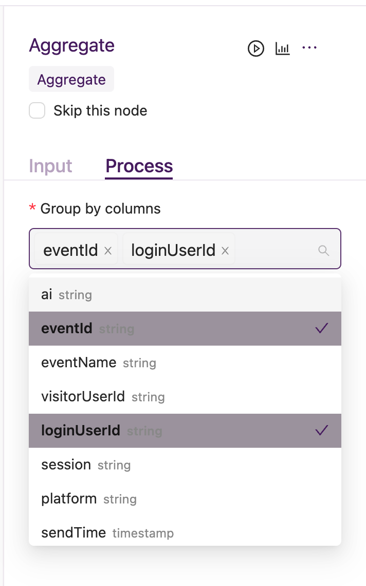
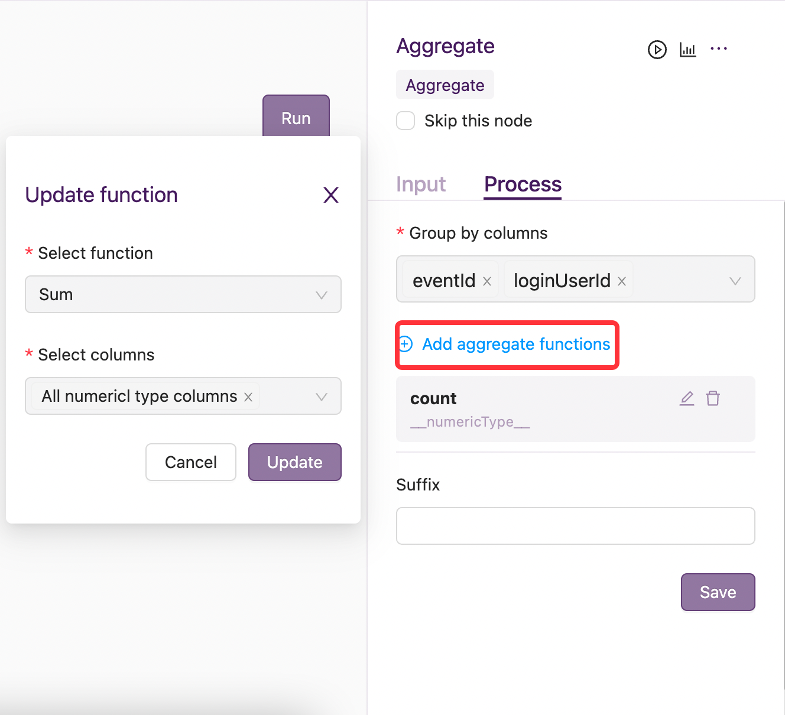

Aggregation
************

1. 场景
==========
用于对数据集做聚合。支持多个分组字段，支持对数值类型、字符类型和日期类型的列进行聚合，同时支持按字段类型进行聚合。

2. 能力
===============
除了传统的聚合函数(``count``、``sum``、``min``、``max``、``avg``、``mean``)之外，
pipeline还提供部分自定义聚合函数（``Decay``、``Frequency``、``Entropy``、``Unique``、``TopValues``、``TopCounts``、``TopPercents``、``BottomValues``、``BottomCounts``、``BottomPercents``）。
自定义函数具体含义如下：

1. Decay:
2. Frequency:
3. Entropy:
4. Unique:
5. TopValues:
6. TopCounts:
7. TopPercents:
8. BottomValues:
9. BottomCounts:
10. BottomPercents:

pipiline支持自定义聚合字段后缀名可选，可用Suffix来指定

3. 输入
==========
需要指定group by columns，添加aggregate function 且聚合后字段名后缀可选

4. 案例说明
===========

设输入如下数据：某小程序应用的页面访问行为数据，每条记录代表一次访问行为，分别记录用户 ``user_id``、日期 ``date``、行为 ``event``、停留时长 ``stay``。

===================  =============  ============  ==========
      user_id          date         event         stay
===================  =============  ============  ==========
1234                   2021-01-01   visit_main    1.5
1234                   2021-01-02   visit_detail  4.0
1234                   2021-01-02   visit_detail  2.2
5678                   2021-01-02   visit_main    1.1
5678                   2021-01-02   visit_main    2.0
===================  =============  ============  ==========

若聚合目标是：每个用户每天每个页面访问次数和访问时长。
根据以上输入数据和聚合目标，需指定group by columns 是 ``user_id`` 、``date`` 、``event``，aggregate function和columns分别是 ``Count`` 、 ``event`` 与 ``Sum``、 ``stay``，则经过aggregation节点处理后，输出如下：

====================================  ============  ===============  ===============  =================
      user_id                            date         event             event_count     event_stay_sum
====================================  ============  ===============  ===============  =================
1234                                   2021-01-01     visit_main        1               1.5
1234                                   2021-01-02     visit_detail      2               6.2
5678                                   2021-01-02     visit_main        2               3.1
====================================  ============  ===============  ===============  =================
