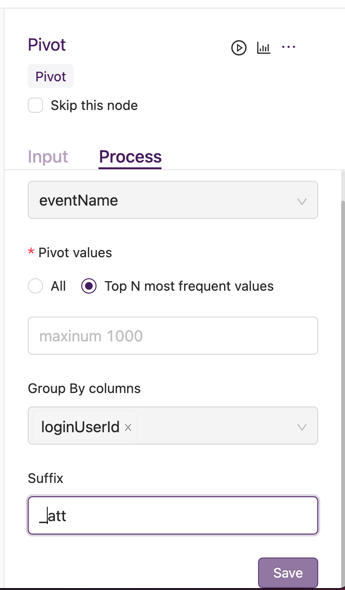

Pivot
*************

1. 场景：用于数据集行转列，将数据集某列各值转置为列名。
2. 输入：需要指定转置的字段名（唯一且必选）；待转置字段可选择所有值或TOP N进行转置；group by指定字段进行保留；Pivot后新字段名后缀可选

3. 案例说明,输入数据如下：

=========================================  ===============  ============
 user_id                                     event           num
=========================================  ===============  ============
 1234                                        click_pay          2
 1234                                        visit_home         3
 1234                                        visit_detail       4
 5678                                        pay_done           5
 5678                                        visit_list         6
=========================================  ===============  ============

以上输入数据，若指定Pivot column 是 ``event`` ,group by columns是 ``user_id`` 则经过Pivot节点处理后，输出如下：

====================================  ==========  ===========  ============  ===========  ==========
      user_id                           click     visit_home   visit_detail  pay_done     visit_list
====================================  ==========  ===========  ============  ===========  ==========
 1234                                      2           3           4
 5678                                                                           5           6
====================================  ==========  ===========  ============  ===========  ==========