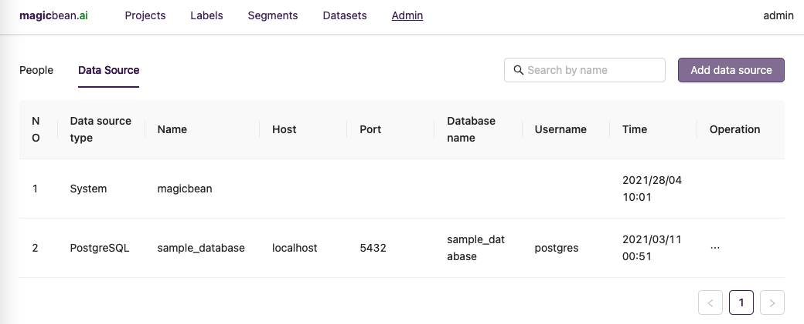
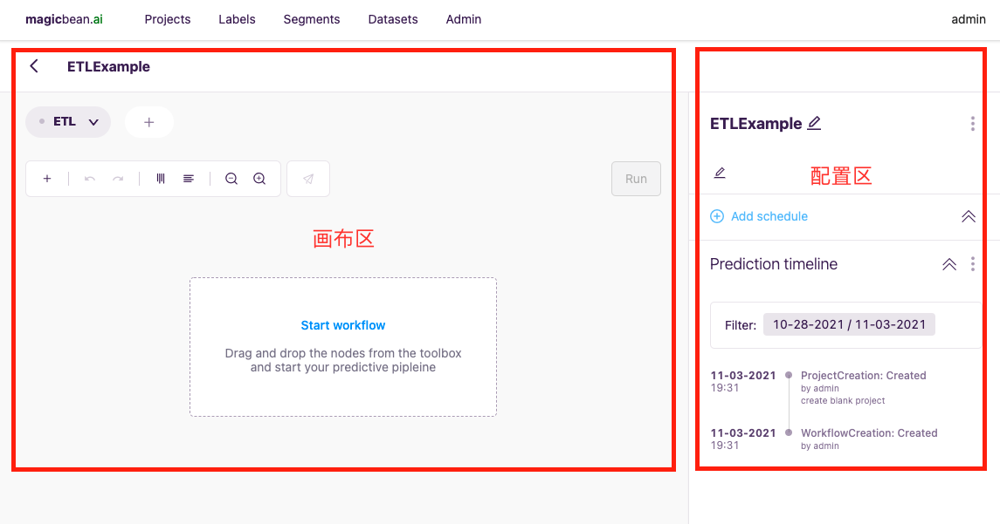

Simplest ETL
*************

在传统机器学习项目构建场景下，数据科学专业人员需要从数据源中提取特征转为机器学习模型适用的数据。为了机器学习的数据预处理工作意味着大量的清洗脚本和复杂的SQL逻辑，导致整个数据链路背后是难以量化的机器成本和人力成本。

然而，实际在数据预处理阶段，已经存在着大量典型的处理范式。魔豆系统中将典型的数据处理操作抽象封装，构建出魔豆特有的数据处理算子。使用魔豆提供的数据处理算子，可免除重复工作快速完成ETL，有效的削减构建成本。
使用魔豆产生的ETL结果可以直接用到魔豆系统中的机器学习模型中，从数据预处理阶段到机器学习阶段不再是两个割裂的过程。

一个典型ETL场景是，将源数据库中的某张表清洗为机器学习模型训练所需要的数据集。
本示例中使用魔豆系统将PostgreSQL库中的一张表作为数据源演示ETL过程。
逻辑上，我们的构建流程将会覆盖到以下环节：

1. 数据载入，加载数据集进系统中；
2. 数据筛选，过滤数据集中的有效行；
3. 数据转换，将无用无效值替换，统一日期型列输出格式，复杂结构数据转换，聚合统计等；
4. 数据存储，将最终结果落盘，供数据链路下游使用。

下图中示例的数据表 ``events`` 是一张用户行为表。从表结构中我们可以看出用户是在什么时间用什么设备下单的信息。
面对这样的数据集，机器学习专家会考虑如何去做用户购买行为的预测。
但是表中的 ``eventVariable`` 字段是一个类似 ``JSON`` 结构的字符串，要从中提取出 ``platform`` 才能确认设备平台信息，
下单价格 ``price`` 也只有在发生付款行为情况才能有值。

我们对这个数据集的使用的预期是可以将 ``platform`` 和 ``price`` 提取为列级，然后再做进一步面向机器学习模型的数据处理。
下面，假设 ``events`` 表已经备好在 ``sample_database`` 库下，我们使用魔豆完成这次ETL。

1. 创建数据源
=============

1. 首次登入系统，需要在管理页添加数据源。操作路径是在登录系统后，进入 ``Admin`` 页面，然后切换到 ``Data source`` 列表页，通过右侧的 ``Add data source`` 按钮触发添加数据源弹窗。
2. 在添加数据源弹窗中，写入数据库配置信息，此处示例数据源是名为 ``sample_database`` 的Postgres数据库。(一般情况下，魔豆对接外部数据源方式是通过 ``JDBC`` 形式。)
3. 数据源添加完成后， ``Data source`` 列表页会显示添加数据源信息。接下来进入到ETL环节。

2. 创建ETL项目
==============

1. 创建新项目的操作路径是在 ``Projects`` 页面中点击 ``Create new project`` 按钮，然后在新建弹窗中选择 ``Create an empty project``。
2. 项目创建后进入编辑界面，可以看到工具界面主要分为两大部分：画布区和配置区。画布区负责用不同 ``节点`` 构建Pipeline，配置区负责画布内选中 ``节点`` 的配置。后续的ETL操作都将在这里展开。

3. 空项目创建完成后，点击画布区中的 ``Start workflow`` 或画布区左上方 ``+`` 图标，就会弹出魔豆的节点工具列表（构建整个数据流的算子就是这些工具）。
4. 拖动工具列表中的 ``Table Loader`` 到画布中央。我们将用这个节点去加载表。
5. 画布中单击选中 ``Table Loader`` 可以看到配置区变换为Table Loader的各个配置项。此处需要注意的是，配置栏分为 ``input`` 和 ``process`` 两个选项卡，分别代表着数据进入节点前和数据在节点中计算的需要用到的配置有哪些。一般情况下会在 ``input`` 内完成数据裁剪，然后在 ``process`` 内根据节点特性做参数配置。
6. 我们先尝试用 ``Table Loader`` 节点完成数据接入的工作，在该节点的 ``input`` 中选择最初添加好的数据源（``Data Source``）以及源表（``Table``），使用 ``Add operation`` 中 ``keep`` 操作保留需要的字段，这样的操作相当于在UI界面下完成了一次SQL语句的SELECT字段操作。继续 ``Add operation`` 添加一个 ``filter`` 相当于SQL语句的WHERE筛选操作。常见的二维表逻辑操作，都可以在这里通过配置的方式实现。
7. 本次示例中我们用 ``Add operation`` 的 ``Add filter`` 筛选表中 ``eventName`` 为 ``orderPaid`` 和 ``createOrder`` 的记录。设置 ``Select Dataset`` 为默认的 ``source-data`` 代表当前配置的表，``Filter`` 内添加 ``Condition`` 条件让 ``eventName`` 列 ``=`` 事件名。 
8. ``Table Loader`` 的 ``process`` 中选择 ``Full load`` 然后保存，代表将数据表全量加载到系统中。点击画布区中的 ``Run`` 按钮即可开始执行任务。如果顺利执行成功，节点将变成绿色。点击配置区右上角的图表按钮可以预览生成的数据集。

3. 设计Pipeline
================

截止上面的步骤，算是完成了数据载入和简单的数据筛选的环节。接下来将引入其他节点，通过节点间的连接组合完成数据的清洗转换：

1. 首先处理复杂类型字段，示例中的 ``eventVariable`` 字段是一个类JSON的结构体字符串。我们可以使用 ``Json Flatten`` 节点将结构体中的 ``Key`` 变为列名，对应的值填充到列下。省去适配不同SQL方言中不同的JSON展开方法。配置该节点的 ``Process`` ，``Columns`` 设置为待展开的字段 ``eventVariable`` 即可。展开效果是：

=============  ============  ======== ======================== ========================
  eventName      sendTime     userId   eventVariable_platform   eventVariable_price
=============  ============  ======== ======================== ========================
  orderPaid     2021-10-01      1        PC                         42
 createOrder    2021-10-02      2        iOS                       
 createOrder    2021-10-01      1        Android                    
=============  ============  ======== ======================== ========================

2. 得到一个清洗后的数据集后，继续添加 ``Aggregate`` 节点，预期对当前数据集做聚合操作以期获得每个用户每天级别的统计。 该节点的 ``Process`` 中配置 ``Group by columns`` 代表SQL中GROUP BY列的选择。``Add aggregate functions`` 代表选择聚合的目标字段和聚合函数的选择。弹出的配置窗口中可以发现 ``Select columns`` 不仅支持列名选择，也可以选择去聚合全部字符型列或全部数值型列等。``Suffix`` 是聚合生成列的后缀，此暂时先处置为空。
3. 本次示例中在 ``Aggregate`` 节点里 ``Group by columns`` 选择 ``userId`` 和 ``sendTime`` ， ``Add aggregate functions`` 弹窗内配置 ``Select function`` 为 ``count``， ``Select columns`` 选择为 ``All string type columns``。 
4. 最后，添加 ``Entity Identifier`` 节点连接到Aggregate节点后，配置该节点的 ``Process`` ，让 ``Entity Type` 设置为`User``，``Column`` 设置为 ``userId``。这样做的含义是让系统知道哪个字段代表着用户ID，原因是不同系统间表意用户ID的字段名可能千奇百怪，我们需要手动的标识出来哪个字段代表用户(User)，哪个字段代表商品(Item)。
5. 完成配置后执行 ``Run``，预览 ``Entity Identifier`` 节点的结果，``userId`` 字段被转换为 ``__uuid__`` 字段
6. ``Run`` 执行可能要花一些时间，如果节点颜色状态全部为绿色，代表着整个Pipeline顺利执行结束。

4. 总结
==========

对比以往的ETL实现方式，使用魔豆可以在画布上快速方便的完成整个ETL流的搭建。除了有专门的节点负责数据加载，还可以通过配置的方式实现数据筛选，对复杂的数据结构也有专门的节点应对。最终数据的聚合操作也可以在配置界面中完成。
