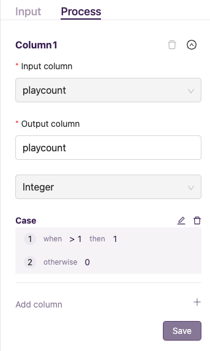

Complex ETL
************

1. 构建Pipeline
================

本示例中使用开放数据集 `millionsongdataset <http://millionsongdataset.com/tasteprofile/>`_ 完成一次包含脏数据清理和二值化处理的ETL示例。
数据集的抽样如下：

=========================================  ======================  ===========
      user                                    song                   playcount
=========================================  ======================  =========== 
b80344d063b5ccb3212f76538f3d9e43d87dca9e    SOAKIMP12A8C130995          1
b80344d063b5ccb3212f76538f3d9e43d87dca9e    SOBVFZR12A6D4F8AE3          1
b80344d063b5ccb3212f76538f3d9e43d87dca9e    SOBBMDR12A8C13253B          6
b80344d063b5ccb3212f76538f3d9e43d87dca9e    SODDNQT12A6D4F5F7E        666666 
b80344d063b5ccb3212f76538f3d9e43d87dca9e                              999999  
=========================================  ======================  =========== 

示例中的数据集包含三个字段：用户ID、歌曲名和播放次数。机器学习中的推荐系统模型可以利用这样的数据去预测某个用户的听歌偏好。
`playcount` 播放次数越多，代表用户越喜欢某首歌曲。
但是示例数据集中的最后一样数据很明显不正常，一首没有ID的歌曲被播放了 `999999` 次，真实行为表中会经常出现这种异常值，我们一般的做法是将这种数据丢弃。
另一行数据播放次数 `666666` ，如果投入模型使用，会把模型带偏，所以需要做清洗操作。

为了适配机器学习，我们将示例数据集进行二值化处理。只听过一次的歌曲清洗为 `0`，听过多次的歌曲标记为 `1`。
默认数据源接入已完成，我们直接使用魔豆完成这项工作。本次构建的ETL链路整体效果如下：

  
1. `Table Loader` 节点完成数据接入的工作。``input`` 内配置导入的表。此处示例表名为 ``millionsongdataset``。
2. 导入完成后，可以使用 ``SQL`` 节点连接，在该节点内，提供了一个SQL编辑器，单击配置栏 ``Process`` 里的 ``Edit`` 按钮即可打开SQL编辑器窗口。编辑器窗口列出了当前可以操作的 ``Dataset`` 和可以使用的函数 ``Function`` 。SQL语句执行的结果就是下一个节点的输入。这里我们先用SQL节点的方式把 ``song`` 为空的记录过滤掉，在编辑框内执行：

.. code-block:: sql

   SELECT * FROM millionsongdataset WHERE song IS NOT NULL

3. 基于第二个节点执行结果，连接 ``Case When`` 节点做二值化处理。配置 ``Process`` 下 ``Input column`` 和 ``Output column`` 为 ``playcount`` 字段。 点击 ``Add case`` 配置当 `playcount` ``>`` `1` 的时候，``then`` 为 `1`，勾选 ``otherwise`` 情况下设置为 ``0`` 。(二值化就算是完成了，如果使用SQL或者其它数据处理脚本语言你可能还需要搜索下类似的 `case when` 条件怎么写。)

4. `Entity Identifier` 配置 ``Process`` ，让 ``Entity Type`` 设置为 ``User``，``Column`` 设置为 ``user`` 。一个经过数据清洗和二值化处理的数据集制作完成。

2. 处理增量更新情况
====================

在实际数据场景中，数据每日都会不断增加。
